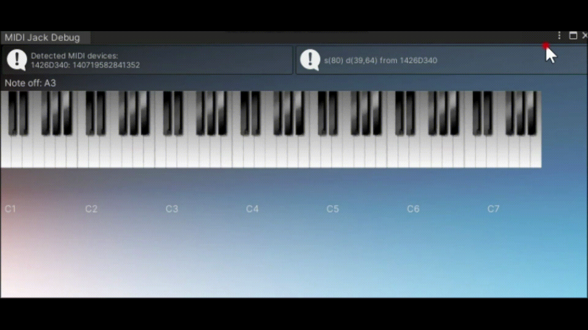
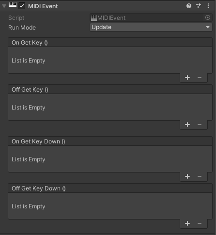
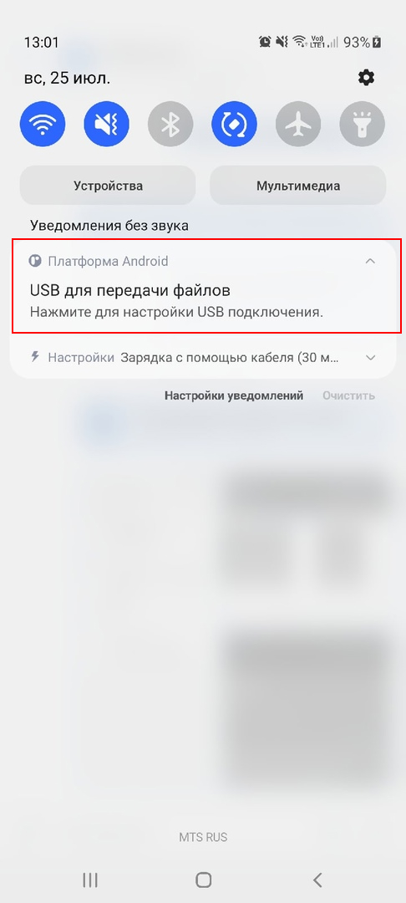
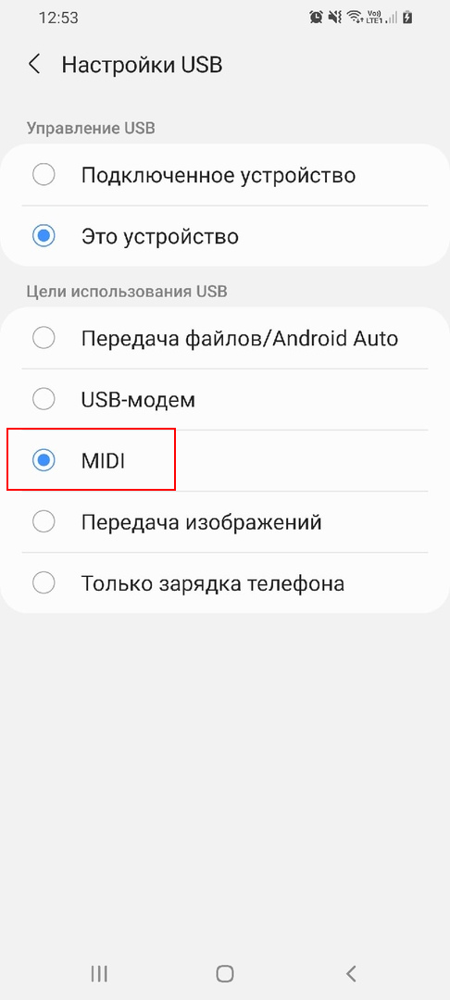
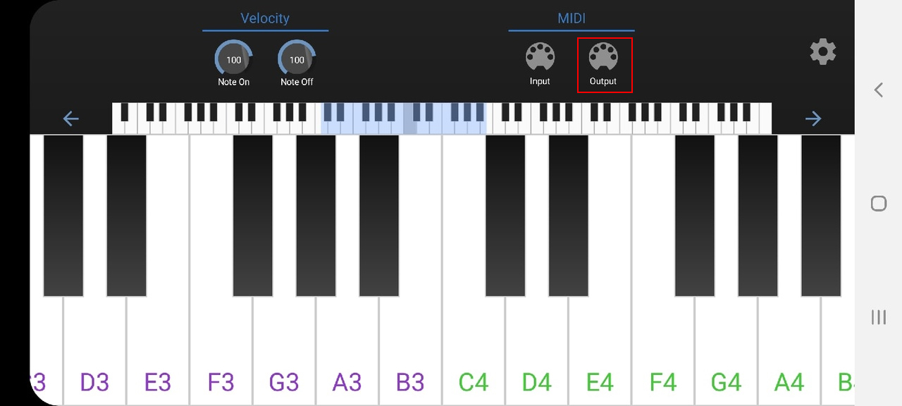
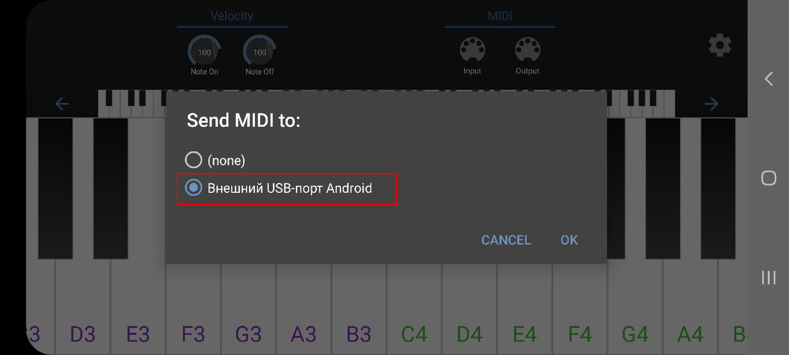

# MIDI Jack Engine
MIDI Jack Engine is a MIDI input plugin upgrade for Unity 2020.
Since the author stopped updating this plugin, I decided to continue updating it.
Many thanks to [Keijiro Takahashi](https://github.com/keijiro) for permission to update this plugin for newer versions of Unity.
You can find the old project [here](https://github.com/keijiro/MidiJack)


# System Requirements:
Unity 2020.3.14f1 (LTS)

Only for Windows
# Installation:
Download and import [MIDIJackEngine.unitypackage](https://github.com/ARtronClassicStudio/MidiJackEngine/releases/download/2021V/MIDIJackEngine.unitypackage) into your project.

if you have questions and suggestions for improvement, write to Issues.

# Examples:
If your project is on Universal Render Pipeline [Download](https://github.com/ARtronClassicStudio/MidiJackEngine/releases/download/2021V/ForUniversalRenderPipeline.unitypackage)

If your project is on a regular [Download](https://github.com/ARtronClassicStudio/MidiJackEngine/releases/download/2021V/ForStandardRender.unitypackage)


# What's new:
1. The structure of the code has been completely changed, something is simplified, something remains as it is.
2. ```MidiMaster``` has now been changed to ```InputMIDI```, you no longer need to add the MidiJack namespace. ```InputMIDI``` Added to the namespace in the UnityEngine so that it will appear next to ```Input```.
3. the ```MidiJack``` namespace has been changed to ```UnityEngine.MIDIJackEngine```, now other classes are there besides InputMIDI.
4. Added a couple more APIs.
5. The MIDI Monitor window has been completely redesigned. 
The MIDI Monitor window is available from the menu ```Window > MIDI Jack Debug```
6. Added event script, you can find it here `Add Component > MIDI Jack Engine > MIDI Event` 


# Minuses:
Since I do not have a Mac, and I have no way to update the libraries for the Mac and build it, so I had to cut out the support for the Mac, but if it appears, then in the next update I will add support.

# Pros:
Support for input from Android via USB
Since I don't have a Midi keyboard, I used android instead for checks.

# Connection via Android:
<details>
<summary>Expand</summary>

1. Download app from Play Market: [Download](https://play.google.com/store/apps/details?id=com.dreamhoundstudios.keyboard) 
  If you see that this application has been deleted in the Play Market, then you can always download it [here](https://github.com/ARtronClassicStudio/MidiJackEngine/releases/download/2021V/MIDI.Keyboard.apk)
2. Press USB mode selection:



3. In the settings USB turn on the MIDI:
  

  
4. Go to the application and click on the output icon and select your device:



 
5. Ready!
</details>

# API Reference:
The basic functions of MIDI Jack Engine are provided in the InputMIDI class.

The channel arguments in the following functions can be omitted. In that case, the functions return the values in the All-Channel slot, which stores mixed status of all active channels.
```C#
InputMIDI.GetKey (channel, noteNumber)
```
Returns the velocity value while the key is pressed, or zero while the key is released. The value ranges from 0.0 (note-off) to 1.0 (maximum velocity).
```C#
InputMIDI.GetKeyDown (channel, noteNumber)
```
Returns true during the frame the user starts pressing down the key.
```C#
InputMIDI.GetKeyUp (channel, noteNumber)
```
Returns true during the frame the user releases the key.
```C#
InputMIDI.GetKnob (channel, knobNumber, defaultValue)
```
Returns the controller value (CC). The value ranges from 0.0 to 1.0.
```C#
InputMIDI.GetKnobNumbers (channel)
```
Returns the list of active controllers.

There are also delegates for the each type of MIDI event.
```C#
InputMIDI.NoteOnDelegate (channel, noteNumber, velocity)
InputMIDI.NoteOffDelegate (channel, noteNumber)
InputMIDI.KnobDelegate (channel, knobNumber, konbValue)
```
Occurs when the user has pressed any button.
```C#
InputMIDI.AnyKey()
```
Returns any value when the button is pressed.
```C#
InputMIDI.AnyKeyInt()
```
same as ```InputMIDI.GetKey()``` only for checks ```if```
```C#
InputMIDI.GetKeyBool()
```

# Examples:
Usage: ```GetKeyBool()``` and ```InputMIDI.AnyKeyInt()```
```C#
    private void Update()
    {
        //Checking if any key is pressed
        if (InputMIDI.GetKeyBool(InputMIDI.AnyKeyInt()))
        {
            Debug.Log(InputMIDI.AnyKeyInt());
        }
    }
```
Usage: ```GetKnob()```
```C#
        public int knobNumber;

        void Awake()
        {
            transform.localScale = Vector3.zero;
        }

        void Update()
        {
            var s = InputMIDI.GetKnob(knobNumber);
            transform.localScale = new Vector3(1, s, 1);
        }
    
```
Usage: ```KnobIndicator```
```C#
        public GameObject prefab;

        List<KnobIndicator> indicators;

        void Start()
        {
            indicators = new List<KnobIndicator>();
        }

        void Update()
        {
            var channels = InputMIDI.GetKnobNumbers();

            // If a new chennel was added...
            if (indicators.Count != channels.Length)
            {
                // Instantiate the new indicator.
                var go = Instantiate(prefab);
                go.transform.position = Vector3.right * indicators.Count;

                // Initialize the indicator.
                var indicator = go.GetComponent<KnobIndicator>();
                indicator.knobNumber = channels[indicators.Count];

                // Add it to the indicator list.
                indicators.Add(indicator);
            }
        }
```
Usage Delegate:

```C#
        //The delegate is called if a key was pressed
        void NoteOn(MidiChannel channel, int note, float velocity)
        {
            Debug.Log("NoteOn: " + channel + "," + note + "," + velocity);
        }
        //The delegate is called if a key has been released
        void NoteOff(MidiChannel channel, int note)
        {
            Debug.Log("NoteOff: " + channel + "," + note);
        }
        //The delegate is called if the handle has been scrolled
        void Knob(MidiChannel channel, int knobNumber, float knobValue)
        {
            Debug.Log("Knob: " + knobNumber + "," + knobValue);
        }

        //Activating delegates when enabled
        void OnEnable()
        {
        
            InputMIDI.NoteOnDelegate += NoteOn;
            InputMIDI.NoteOffDelegate += NoteOff;
            InputMIDI.KnobDelegate += Knob;
        }

        //Deactivating delegates when enabled
        void OnDisable()
        {
            InputMIDI.NoteOnDelegate -= NoteOn;
            InputMIDI.NoteOffDelegate -= NoteOff;
            InputMIDI.KnobDelegate -= Knob;
        }
 ```
The examples were taken from resource packs.
