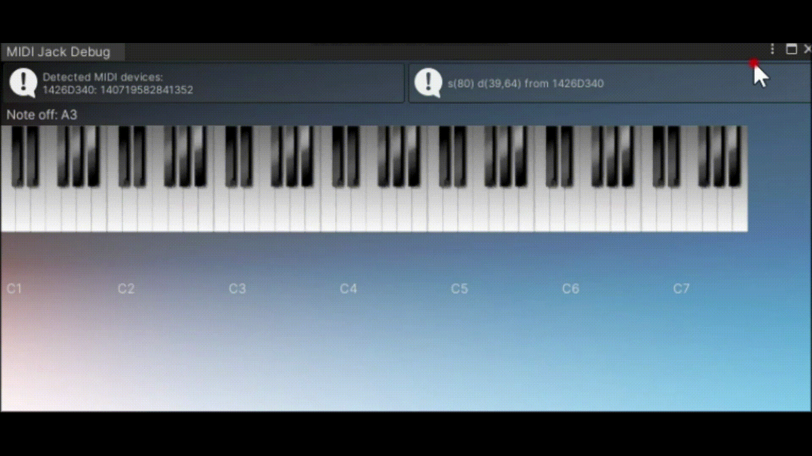

# MIDI Jack Engine
MIDI Jack Engine is a MIDI input plugin for Unity.


# System Requirements
Unity 2020.3.14f1 (LTS)

Only for Windows
# Installation
Download and import [MIDIJackEngine.unitypackage](https://github.com/ARtronClassicStudio/MidiJackEngine/releases/download/2021V/MIDIJackEngine.unitypackage) into your project.

# Examples:
If your project is on Universal Render Pipeline [Download]

If your project is on a regular [Download]


See the troubleshooting topics if you encounter any problems.

# What's new:
1. The structure of the code has been completely changed, something is simplified, something remains as it is.
2. ```MidiMaster``` has now been changed to ```InputMIDI```, you no longer need to add the MidiJack namespace. ```InputMIDI``` Added to the namespace in the UnityEngine so that it will appear next to ```Input```.
3. Added a couple more APIs
4. The MIDI Monitor window has been completely redesigned. 


# API Reference
The basic functions of MIDI Jack Engine are provided in the InputMIDI class.

The channel arguments in the following functions can be omitted. In that case, the functions return the values in the All-Channel slot, which stores mixed status of all active channels.
```C#
InputMIDI.GetKey (channel, noteNumber)
```
Returns the velocity value while the key is pressed, or zero while the key is released. The value ranges from 0.0 (note-off) to 1.0 (maximum velocity).

InputMIDI.GetKeyDown (channel, noteNumber)

Returns true during the frame the user starts pressing down the key.

InputMIDI.GetKeyUp (channel, noteNumber)

Returns true during the frame the user releases the key.

InputMIDI.GetKnob (channel, knobNumber, defaultValue)

Returns the controller value (CC). The value ranges from 0.0 to 1.0.

InputMIDI.GetKnobNumbers (channel)

Returns the list of active controllers.

There are also delegates for the each type of MIDI event.

InputMIDI.noteOnDelegate (channel, noteNumber, velocity)
InputMIDI.noteOffDelegate (channel, noteNumber)
InputMIDI.knobDelegate (channel, knobNumber, konbValue)
MIDI Monitor Window
MIDI Jack provides the MIDI Monitor window, which shows the list of active devices and incoming MIDI messages.

monitor

The MIDI Monitor window is available from the menu Window -> MIDI Jack.

Current Limitations
Currently MIDI Jack only supports Windows and OS X. No iOS support yet.
Only supports note and CC messages. No support for program changes nor SysEx.
The MIDI Jack plugin always tries to capture all available MIDI devices. On Windows this behavior may conflict with other MIDI applications.
